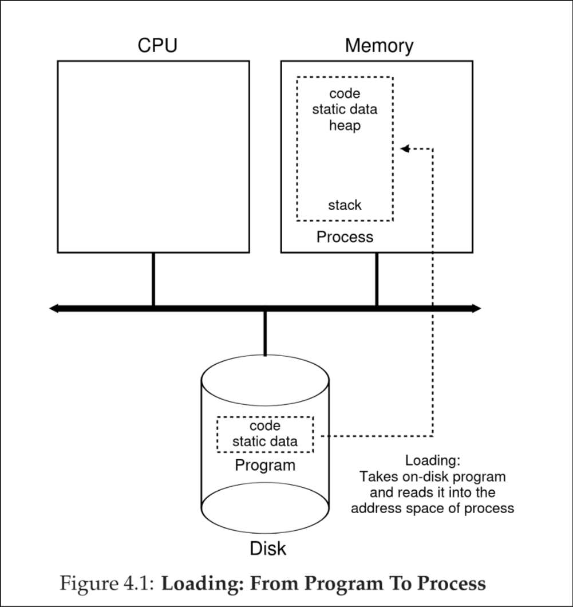

# Process API

We'll defer discussion of a real process until a later chapter but we will give some ideas of what the OS HAS to provide for processes.
In some forms, these APIS are available to any operating system

## Create:
The operating system MUST include a way of creating a process. For example:
- opening a process through a shell.
- double clicking on a program
The OS is invoked to create and run the application you have chosen.
## Destroy:
As there is a way to create a process there's also a way to __destroy__ it forcefully.
Of course many processes will finish and close on their own but the OS also provides to close it forcefully
## Wait:
Sometimes it is better to wait for a process to finish executing that's why the OS also provides a way to __wait__
## Other:
Other than destroying and creating the OS often provides other functionalities
for example:
- suspending a process (Stop it running for a while)
- resuming it (continue it running)
## status:
Every OS needs to have a way of checking the status of a process such as:
- how long it's run for
- what state it's in

