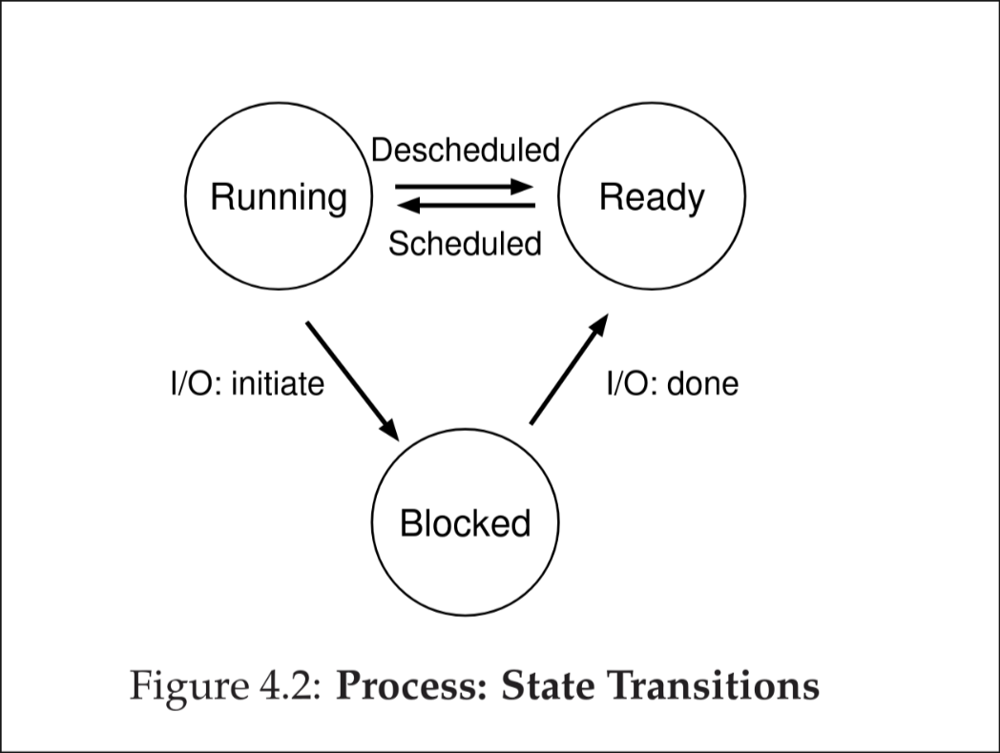

# Process States.
Now that we know what a process is let's go over what states it can be in:

## Running
In the running state the process is running on the processor. This means it's executing instructions.
## Ready
This means that the process is ready to be executed but for some reason the OS chose not to run it at the given moment. 
## Blocked
In a blocked state, the process has made an action that makes it not able to be run until some other event takes place.
A common example:
- When the process initiates an I/O request to a disk, it becomes block and thus the processor can be used on a different process.

